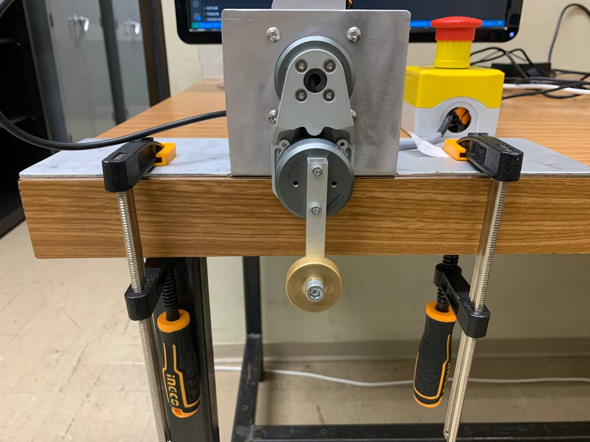

# System: Double Pendulum
<table style="width: 100; border: none;">
  <tr>
    <td align="center">
      <figure>
        
        <figcaption>1. Motors</figcaption>
      </figure>
    </td>
    <td align="center">
      <figure>
        
        <figcaption>2. Top view</figcaption>
      </figure>
    </td>
  </tr>
  <tr>
    <td align="center">
      <figure>
        
        <figcaption>3. Front view</figcaption>
      </figure>
    </td>
    <td align="center">
      <figure>
        
        <figcaption>4. Angled view</figcaption>
      </figure>
    </td>
  </tr>
</table>

---

## 1. Create virtual environment
```bash
cd ece-robotic-systems-II/homework-4/code
```

```bash
python -m venv .venv
```

```bash
source .venv/bin/activate
```

---

## 2. Install dependencies
```bash
pip install -r requirements.txt
```

--- 

## 3. Folders' organization
### assignment-report
This folder contains my final report. The assignment corresponds to homework 3.

---

### candle
This folder contains example code in C++ and Python.  
Click [here](https://github.com/mabrobotics/candle) if you want to explore repository in GitHub.  

---

### code
There are 3 <code>.py</code> or <code>.ipynb</code> files:  

* 1-trajectory-optimization.ipynb
* 2-TVLQR.ipynb
* 3-hardware-implementation.py  

and 4 <code>.csv</code> files:

* results-tl-009.csv: it has optimized state and control input vectors (torque_limit=0.09)
* results-tl-015.csv: it has optimized state and control input vectors (torque_limit=0.15)
* gains-tl-009.csv: it has gain values Ks (torque_limit=0.09)
* gains-tl-015.csv: it has gain values Ks (torque_limit=0.15)

---

### figures\double-pendulum
Here are figures of the real system.

---

### figures\simulation-results
Here are the simulation result figures.

* optimal-trajectory-tl-009: optimal trajectory (torque_limit=0.09)
* optimal-trajectory-tl-015: optimal trajectory (torque_limit=0.15)
* optimal-trajectory-diagrams-tl-009: diagrams of angles and torques (torque_limit=0.09)
* optimal-trajectory-diagrams-tl-015: diagrams of angles and torques (torque_limit=0.15)

---

### motors-tests
This folder contains tests for:

* pyCandle.IMPEDANCE mode
* pyCandle.RAW_TORQUE mode
* pyCandle.VELOCITY_PROFILE mode

---

### videos
Here are videos of the real system demos:

* demo-tl-009: demo for torque_limit=0.09
* demo-tl-015: demo for torque_limit=0.15

---

# Instructions for CANdle and MADtool (Linux OS instructions)
### Useful link: [MAB Ecosystem](https://mabrobotics.github.io/MD80-x-CANdle-Documentation/intro.html)
### [Installing MDtool](https://github.com/mabrobotics/mdtool/tree/main)  
1. Download [mdtool-amd64-1.5.4-Linux.deb](https://github.com/mabrobotics/mdtool/releases)

Open a terminal and follow the above steps:

2. Go to Downloads folder:
```bash
cd Downloads/
```  
4. Add your current user to the dialout group. In Linux, this is required to give your user permission to read and write to serial/USB ports (like the CANdle adapter) without needing sudo for every command:  
```bash
sudo adduser <current_username> dialout
```  
5. Install the MDtool console application:  
```bash
sudo apt install ./mdtool-amd64-1.5.4-Linux.deb
```  
6. Install a utility that allows MDtool to configure the serial port for higher communication speeds and lower latency, which is critical for real-time motor control:  
```bash
sudo apt install setserial
```

### [CANdle (python) library installation](https://github.com/mabrobotics/candle/tree/main)  
Open a new terminal and follow the above steps (in ***active*** ```.venv``` that you constructed earlier):  
```bash
cd <your_path_in_active_venv>
```
```bash
pip install pybind11
```
```bash
pip install pyCandleMAB
```  

If you want to run examples from examples\_python folder follow these steps (stay at the same folder)
```bash
git clone https://github.com/mabrobotics/candle.git
```  
```bash
cd candle/examples_python
```  
```bash
examplei.py
```  

If you want to find drivers, run:  
```bash
mdtool ping all
```
